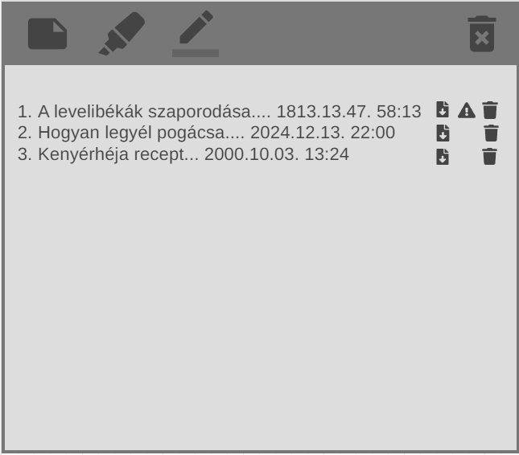
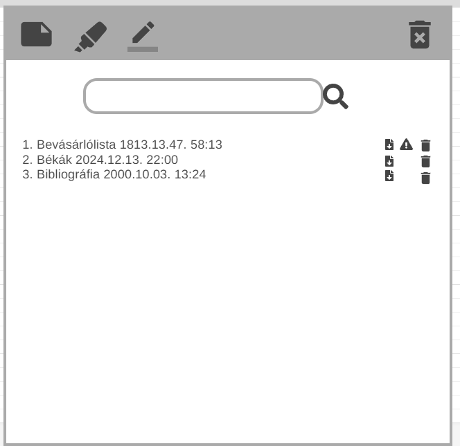
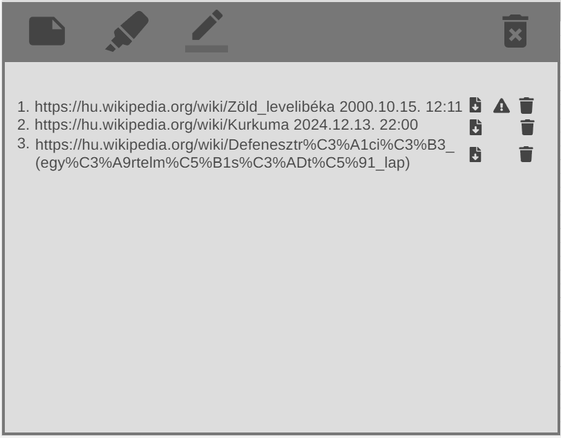
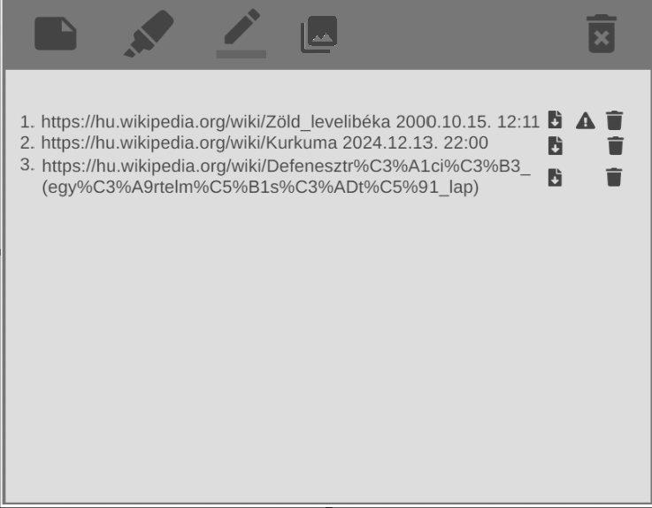
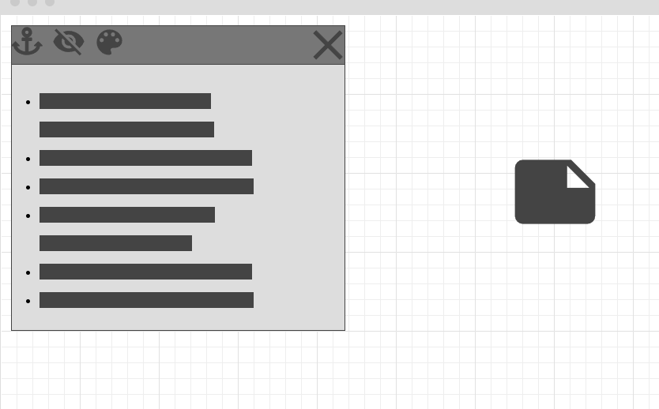
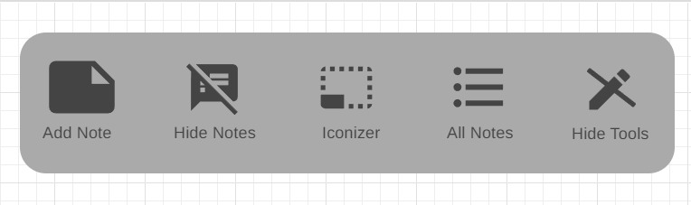

# Concept Design 

## All Notes:
  ,
- Egy különálló oldal 
- A felső sorba egy kereső van, ami a jegyzetekben, illetve a kiemelések között keres 
- Négy csoportot különböztetünk meg:
    - Jegyzetek
        - id, cím(ez egy link, ami a jegyzethez visz, vagy csak ahhoz az oldalhoz) (40 karakter?), módosítás dátuma
        - törlés: törli az aktuális az elemet (+ megerősítő ablak)
        - figyelmeztetés: Ha elveszhet a jegyzet(oldal megszünése stb.....)
            - jegyzet elmentése (md fájl), vagy az aktuális oldalon a jegyzet módosítása
        - letöltés: md fájl formátumban
            > "4. <u>Bevásárlólista</u>  1813.13.47. 58:13 ⬇️⚠️🚮"
    - Kiemelések
        - id, kiemelt szöveg egy része (ez egy link, ami a kiemeléshez visz, vagy csak ahhoz az oldalhoz) (40 karakter?), módosítás dátuma
        - törlés: törli az aktuális az elemet (+ megerősítő ablak)
        - figyelmeztetés: Ha elveszhet a kiemelés(oldal megszünése stb.....)
            - kiemelés elmentése (md fájl), vagy az aktuális oldalon a kiemelés módosítása
        - letöltés: md fájl formátumban
            > "15. <u>A levelibékák szaporodása....</u>  1813.13.47. 58:13 ⬇️⚠️🚮"
    - Rajzok
        - id, oldal link (ahhoz az oldalhoz) (40 karakter?), módosítás dátuma
        - törlés: törli az aktuális az elemet (+ megerősítő ablak)
        - figyelmeztetés: Ha elveszhet a rajz (oldal megszünése stb.....)(oldd meg!!!)
            > "42. <u>https://hu.wikipedia.org/wiki/Z%C3%B6ld_levelib%C3%A9ka</u>  2000.10.15. 12:11 ⬇️⚠️🚮"
    - Képek
        - id, kép neve (link az oldalhoz), létrehozás dátuma
        - törlés: törli az aktuális elemet (+ megerősítő ablak)
        - figyelmeztetés: Ha elveszhet a kép (oldal megszünése stb.....)
        - letöltés: (png vagy más formátumban)
            > "125. <u>béka.png</u> 2013.10.01. 10:00 ⬇️⚠️🚮"

## Note:

- Egyetlen jegyzet kinézete
- Új jegyzet hozzáadásakor jön létre
- Elemei:
    - Menüsor: 
        - horgony (alap esetben rögzít, más esetben az oldallal együtt gördül)
        - jegyzet színezése (alap 5 szín, rgb paletta)
        - feltöltés (md, txt) (felül írja az egész jegyzetet)
        - letöltés (md, txt)
        - előnézet/szerkesztőnézet
        - ~~elrejtés~~
        - kuka (törlés)
        - ikonná varázsóló X (ha üres akkor törli, ha van venne valami akkor lekicsinyíti)
    - Cím
    - Szöveg helye
    - Alap szerkesztő:
        - dőlt betű, aláhúzás, félkövér, színek, betűtípus, lista stb...
        - kép feltöltés
        - rajzolás 

## Popup

- Ez az alkalmazás popup-ja
- Elemei:
    - Add Note: új jegyzet létrehozása
    - Hide Notes / Show Notes :  megjelenít/ elrejt minden jegyzetet az oldalon
    - Iconizer/ Undo: lekicsinyít minden jegyzetet icon méretűre/ felnagyít minden jegyzetet normális méretre (milyen méret legyen?)
    - All Notes: átvisz arra az oldalra, ahol megjeleníti az összes jegyzetet
    - Hide Tools/ Tools: a rajzoló eszközök elrejtése és megjelenítése

## Toolbar

- Oldal jobb felső sarkában megjelenő eszközkészlet.
- ~~Ha sikerül megoldani mozdíthatóra, akkor mozdítható, ha nem akkor nem~~
- Mozdítható lesz: egy + ikont kap, amivel szabadon mozgathatóvá válik az oldalon.
- Elemei:
    - 🔄️: elforgatja az eszközbárt
    - ✏️: lehet rajzolni az oldalra
    - 🖍: Az oldalon lévő szöveget lehet ezzel kiemelni
    - 🧼: Törölni lehet a kiemeléseket és a rajzokat. Egy egész vonalat töröl.
    - 🟥🟨🟩: 3 alap szín (megjegyzi, hogy melyiket használta legutoljára a ceruzához, és melyiket a kiemeléshez)
        - ezt a 3 színt elmenti külön a tollnak, illetve a kiemelőnek
        - minden oldalon ugyanaz a 3 szín létezik (nincs oldalakra külön-külön)
        - Színek:
            - Jobb klikk: Változtatás
            - Bal klikk: Kiválasztás
    - Vastagság állítása opcionális:)

## Figyelmeztetés
 kép helye
- Akkor jelenik meg, mikor a tartalom feltehetően el fog veszni
